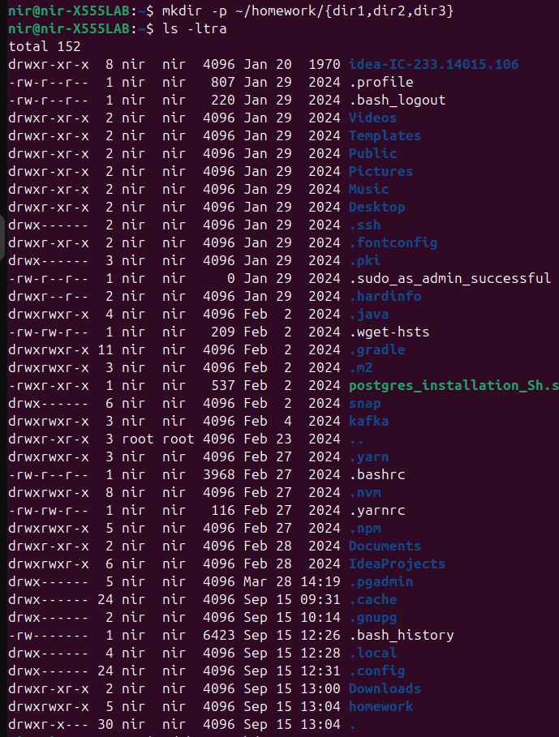
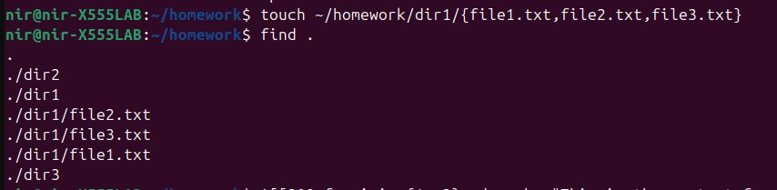
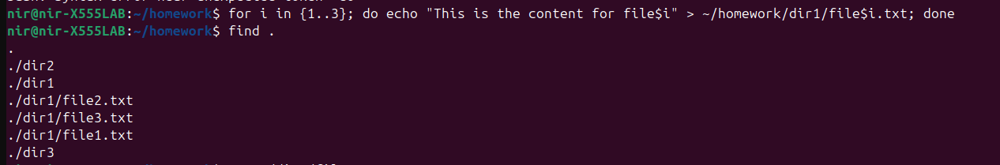
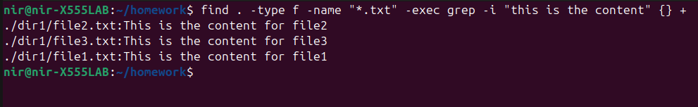
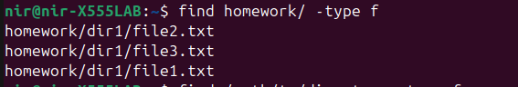

# DEX Course Homework Repository

# Overview
This repository contains the homework assignments for the DEX (DevOps Experts) course. 
It includes commands used, screenshots of terminal output, and explanations.

# Note: I didn't use the VB since I had Ubuntu LTS 22 installed, so instead I just upgraded it to the latest LTS 24. 

# Contents

# Commands Used

 	# Checking Ubuntu Version 
 	
	Command: lsb_release -a
 
	Explanation: This command helps you confirm the current version of Ubuntu installed on your system. 
                     After upgrading from Ubuntu LTS 22 to LTS 24, running this command will show the new version information and verify 
		     that the upgrade process was completed successfully.

	

	# Creating Directories:

	Command: mkdir -p ~/homework/{dir1,dir2,dir3}
	
	Explanation: This command creates a directory structure under ~/homework with subdirectories dir1, dir2, and dir3. 
	The -p option ensures that parent directories are created as needed.

        
	
	# Creating Files:
	
	Command: touch ~/homework/dir1/{file1.txt,file2.txt,file3.txt}
	
	Explanation: This command creates three text files in the dir1 directory.

 	
	
	# Adding Content:
	
	Command: for i in {1..3}; do echo "This is the content for file$i" > ~/homework/dir1/file$i.txt; done
	
	Explanation: This loop command automates the process of adding content to multiple files. It iterates over a range and writes specific content to 

	each file based on the iteration number.            

        

        # Find text in files
	Command: find . -type f -name "*.txt" -exec grep -iH "this is the content" {} +

	or grep -i "this is the content" ~/homework/dir1/*.txt

	Explanation:
	Sub Cmd1 - find . -type f -name "*.txt": This finds all .txt files under the current directory and its subdirectories.
	Sub Cmd2 - -exec grep -iH "this is the content" {} +: This runs grep on each found file.
	Key Options:
	-i: Makes the search case-insensitive.
	-H: Ensures grep includes the filename in the output (useful if you are searching across multiple files).

 	

        # Find Files in Directory
	Command: find ~/homework/ -type f
        Explenation: Find files within a specific directory  
	Key Options:
	/path/to/directory: Replace with the path to the directory where you want to search.
	-type f: Specifies that you want to find files (not directories).

        

	# Find files modified within the last 7 days
 	Comamnd: find ~/homework/ -type f -name "*.txt" -mtime -7
  	Explanation:
	~/homework/: This specifies the directory to search in. The ~ represents the home directory.
	-type f: This ensures we are looking for files (not directories).
	-name "*.txt": This filters the results to only .txt files.
	-mtime -7: This finds files that have been modified within the last 7 days.

        
	
