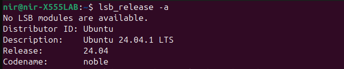

# DEX Course Homework Repository

# Overview
This repository contains the homework assignments for the DEX (DevOps Experts) course. It includes commands used, screenshots of terminal output, and explanations of each step to help track and review your assignments.

# Contents

# Commands Used

	# Checking Ubuntu Version (I didn't use the VB since I had Ubuntu LTS 22 installed, so instead I just upgraded it to the latest LTS 24. )
	
	Command: lsb_release -a
 
	Explanation: This command helps you confirm the current version of Ubuntu installed on your system. 
                     After upgrading from Ubuntu LTS 22 to LTS 24, running this command will show the new version information and verify 
		     that the upgrade process was completed successfully.

        Screenshot: 
 
	# Creating Directories:

	Command: mkdir -p ~/homework/{dir1,dir2,dir3}
	
	Explanation: This command creates a directory structure under ~/homework with subdirectories dir1, dir2, and dir3. 
	The -p option ensures that parent directories are created as needed.
	
	# Creating Files:
	
	Command: touch ~/homework/dir1/{file1.txt,file2.txt,file3.txt}
	
	Explanation: This command creates three text files in the dir1 directory.
	
	# Adding Content:
	
	Command: for i in {1..3}; do echo "This is the content for file$i" > ~/homework/dir1/file$i.txt; done
	
	Explanation: This loop command automates the process of adding content to multiple files. It iterates over a range and writes specific content to 

	each file based on the iteration number.                                                                                                                                                                               
